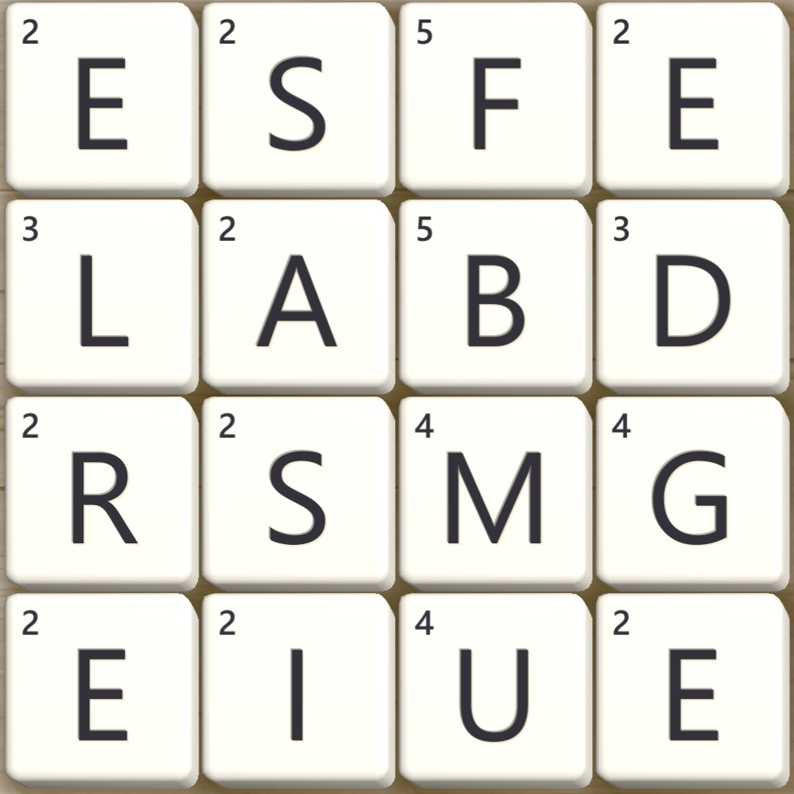

<p align="center">
  <a href="" rel="noopener">
 </a>
</p>

<h3 align="center">Wordament Solver</h3>

<div align="center">

[]()
[](https://github.com/blackmonk13/wordament_solver/issues)
[](https://github.com/blackmonk13/wordament_solver/pulls)
[](/LICENSE)

</div>

---

<p align="center"> A simple tool to help you find words in Wordament puzzles using OpenCV.
    <br>
</p>

## 📝 Table of Contents

- [About](#about)
- [Getting Started](#getting_started)
- [Usage](#usage)
- [Built Using](#built_using)
- [Authors](#authors)
- [Disclaimer](#disclaimer)

## 🧐 About <a name = "about"></a>

Wordament Solver is a Python project that helps you find words in Wordament puzzles. It uses image processing techniques to extract the grid data from a screenshot of the game, and then employs a trie data structure to efficiently search for valid words in the puzzle. The project also displays the highest-scoring words and shows the path of each word on the grid using arrows.

## 🏁 Getting Started <a name = "getting_started"></a>

To get started with Wordament Solver, follow these steps:

1. Clone the repository:
```
git clone https://github.com/blackmonk13/wordament_solver.git
```
2. Install the required packages:
```
pip install -r requirements.txt
```
3. Run the project using a sample puzzle or a screenshot of the game.

## 🎈 Usage <a name="usage"></a>

### CLI Usage

```
python -m wordament_solver -h
```
When you have a cropped grid image like the following 




``` python
python -m wordament_solver --image sample_images/grid/regular_grid.jpg --cropped --view
```

### Example Usage

For more detailed examples and use cases, refer to the `example.ipynb` notebook. It covers common scenarios and demonstrates how to use the package when imported as a package in other projects.

### Usage as a package


## ⛏️ Built Using <a name = "built_using"></a>

- [Python](https://www.python.org/) - Programming Language
- [NumPy](https://numpy.org/) - Array Processing Library
- [OpenCV](https://opencv.org/) - Image Processing Library
- [Pillow](https://pillow.readthedocs.io/en/stable/) - Image Processing Library
- [PyTesseract](https://github.com/madmaze/pytesseract) - OCR Library
- [NLTK](https://www.nltk.org/) - Natural Language Processing Library
- [SciPy](https://docs.scipy.org/doc/scipy/reference/) - Statistics Library

## ✍️ Authors <a name = "authors"></a>

- [@blackmonk13](https://github.com/blackmonk13) - Idea & Initial work

See also the list of [contributors](https://github.com/blackmonk13/wordament_solver/contributors) who participated in this project.


## 📝 Disclaimer <a name = "disclaimer"></a>

Wordament Solver is not affiliated with, endorsed, or sponsored by Microsoft Corporation or the creators of Wordament. The project is intended for educational and entertainment purposes only. Any use of this project to gain an unfair advantage in the game or to violate the terms of service of Wordament or Microsoft Corporation is strictly prohibited. The authors and contributors of this project are not responsible for any misuse of the software.
